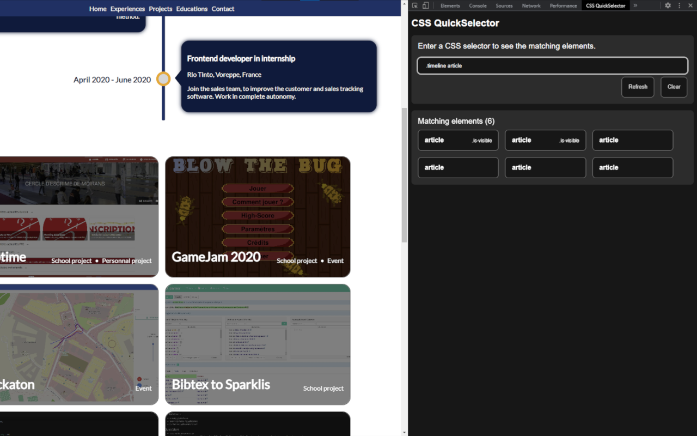
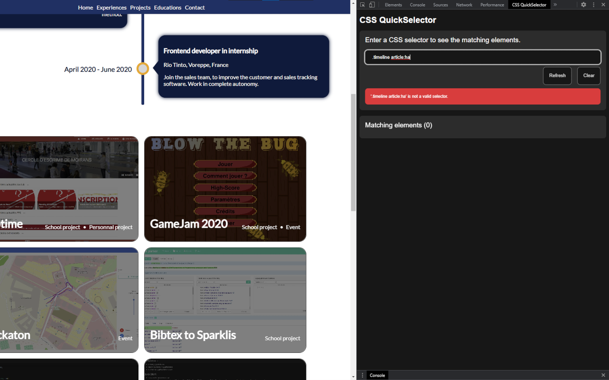

# CSS QuickSelector
CSS QuickSelector is the ultimate Chrome extension for writing and testing CSS selectors in real-time, all without ever leaving your browser. With our user-friendly interface and error-checking technology, you can be confident that your selectors will work as intended, saving you valuable time and effort.

## Features
- Write and test CSS selectors directly in the DevTools "CSS QuickSelector" panel
- Intuitive interface for beginners and advanced users alike
- *Customization options to suit your specific needs* [Work in progress]
- Advanced error-checking technology to catch syntax errors and typos
- Lightning-fast performance for maximum productivity

# Screenshots

# Installation
To install CSS QuickSelector, follow these simple steps:

- Go to the Chrome Web Store and search for "[CSS QuickSelector](https://chrome.google.com/webstore/detail/css-quickselector/hpafiahdjpelojolbkknjhhdpbhkpjln)"
- Click on "Add to Chrome" to install the extension.
- Once installed, the extension icon will appear next to your address bar.
- Open the DevTools console in your browser by pressing F12 or by right-clicking on the page and selecting "Inspect."
- Click on the "CSS QuickSelector" tab to open the CSS QuickSelector panel.

## Usage
Using CSS QuickSelector is incredibly easy. Here's how to get started:

1. Open the DevTools console in your browser by pressing F12 or by right-clicking on the page and selecting "Inspect."
2. Click on the "QuickSelector" tab to open the CSS QuickSelector panel.
3. Start typing your selector in the input box at the top of the panel.
4. If your selector is valid, CSS QuickSelector will list all the elements found, along with their associated IDs and classes. You can click on any of these elements in the list to automatically scroll to that element on the page.
5. If your selector contains a syntax error or typo, CSS QuickSelector will display an error message in the panel, helping you to identify and correct the issue.

## Customization
*Coming soon !*

## Work in progress
- [ ] Customization options
- [ ] Highlighting of selected elements

# Support
If you encounter any issues with YouTube Subscription Short Hider or have any suggestions for new features, please feel free to open an [issue](https://github.com/pH0xe/CSS-QuickSelector/issues) on our GitHub repository.

# License
This project is licensed under the terms of the [GNU General Public License version 3](https://opensource.org/license/gpl-3-0/)
